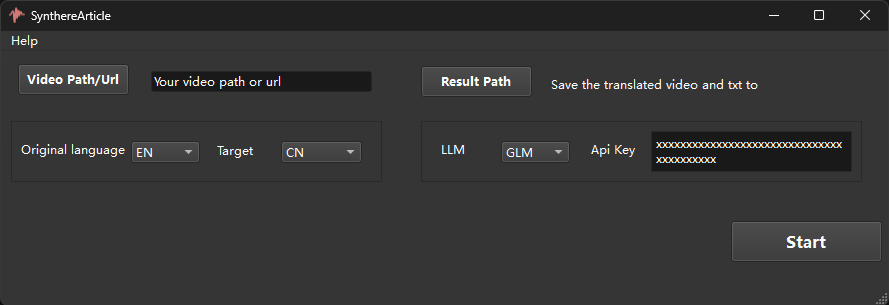
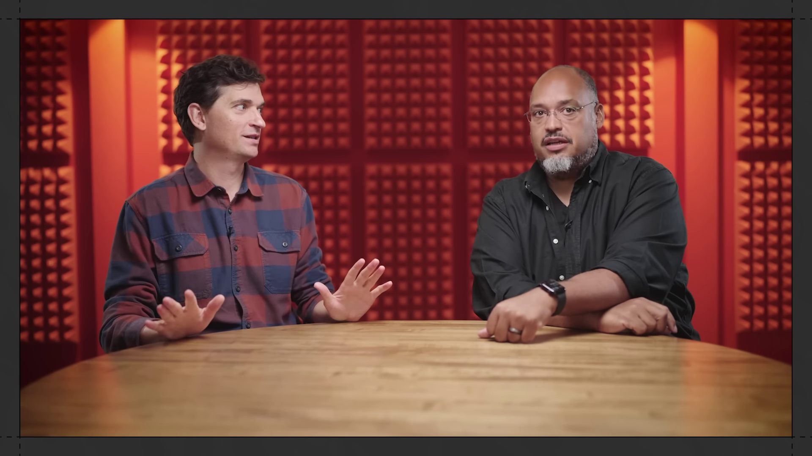
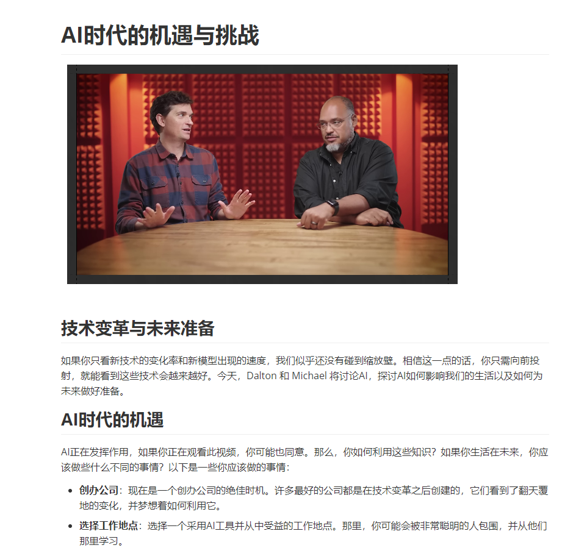

# SynthereArticle: Convert video to Article with AI

 
SynthereArticle convert videos in different languages into articles in a specified language with just one URL link. Free LLM is used.
 

 

https://www.youtube.com/watch?v=wRLTfC_PMKU

The following figure is part of the output result of the video "The AI Future Has Arrived: Here's What You Should Do About It"above

 

##  Updates

- 2024-12-6 first version, output markdown article.

## Hardware requirements

 Can run on CPU or GPU. The CPU runs slower when running the advanced version. If running on a GPU, you need at least 8GB of video memory; It is recommended to use 16GB or more of memory for CPU operation.

##Supported Languages
Currently, only English to Chinese translation is supported.

##  Download and use

* It can be downloaded for free and can be used without installation or clicking. Download link: https://pan.baidu.com/s/1VYix5jLQpGFsPfKtVupzpg  Code: ctas
* Currently you need to use the free version of GLM, glm-4-flash. Please apply for here:https://bigmodel.cn/ and set the API key yourself before start.

## References
Mainly relies on the following open-source projects
- [Whisper](https://github.com/openai/whisper) 
- [edge-tts](https://github.com/rany2/edge-tts)
- [moviepy](https://github.com/Zulko/moviepy)
- [PySide6](https://pypi.org/project/PySide6/)

